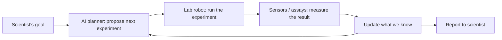

# What is an autonomous lab?

> *A lab where AI and robots run experiments with less human-in-the-loop, in a continuous loop.*

An **autonomous lab** is a setup where software decides what experiment to run, hardware runs it, and the same software learns from the result and chooses the next experiment. Humans set the goal and review the outputs; the loop in the middle is automated.

It is sometimes called a *self-driving lab*. The two terms mean the same thing.

## The idea in one example

Suppose you want a molecule that blocks a specific protein in the brain but does not poison healthy cells. You could:

1. Buy ten thousand candidate molecules. Try them one by one. Slow, expensive, mostly wasteful.
2. Hire an autonomous lab. Tell it the goal. Let it propose, test, learn, propose again.

Option 2 is what this section is about.

## The closed loop

The arrows in a circle are the point. The scientist gives a goal; the loop turns. Without the loop, you have *automation* (robots that do what you tell them) but not *autonomy* (a system that decides what to do next).

## The four parts

| Part | What it does | A homely analogy |
| --- | --- | --- |
| **AI planner** | Decides which experiment to try next, given everything tried so far. | A chess player choosing the next move. |
| **Robotic equipment** | Pipettes liquids, grows cells, takes pictures, runs assays. | The hands. |
| **Data analysis** | Turns raw measurements into interpretable numbers (cell counts, drug potency, etc.). | The eyes that read what the hands made. |
| **Feedback loop** | Sends the analysis back to the planner so it can pick a better next experiment. | The lesson learned after each move. |

Each part fails differently:

- The planner can pick experiments that look promising but are physically impossible.
- The robot can spill, miss a well, or jam.
- The analysis can mis-segment a cell or mis-call a peak.
- The loop can be fast, slow, or broken.

A real autonomous lab spends most of its engineering effort on the *feedback loop* and *failure handling*, not on the showy parts.

## What kinds of science use this

| Field | What gets sped up |
| --- | --- |
| Drug discovery | Searching giant chemical libraries for hits. |
| Materials science | Finding new battery electrolytes, catalysts, alloys. |
| Synthetic biology | Engineering microbes to produce a target molecule. |
| Protein engineering | Designing enzymes with desired activity. |
| Diagnostic-assay development | Tuning a clinical test for sensitivity and specificity. |

In neuroscience the wins are quieter today — brain experiments are slower and harder to automate than chemistry — but the same ideas apply to high-throughput electrophysiology, organoid screening, and behavioural assays in model organisms.

## Why this is hard

Three honest reasons autonomous labs are slow to spread:

1. **Robots are picky.** Real biology has live cells, contamination, and human assistants who reach into the deck. Robots that are reliable in a vendor demo are flaky in a real lab.
2. **Closed loops are hard.** A planner that learns over thousands of cycles needs measurements to come back clean, fast, and consistent. Most labs cannot deliver that yet.
3. **Goals are fuzzy.** "Find a good drug" is not a precise goal. Translating a scientific question into something the planner can optimise is its own skill.

If you read a vendor brochure that ignores these, treat it as marketing.

## What this level intentionally skips

- The optimisation math the planner uses — see [PhD: Bayesian optimisation](../phd/bayesian-optimization.md).
- The control software that talks to the robots — see [Intermediate: Lab robotics](../intermediate/robotic-equipment.md).
- How to run one of these in production — see [Senior engineer: Architecture](../engineer/architecture.md).

For now, you can finish this level confident that you know:

- An autonomous lab is a closed loop of AI + robot + analysis + feedback.
- The interesting part is the loop, not any single piece.
- It is real, but rare, and the failure modes deserve respect.

## Next

- [What is literature synthesis?](literature-synthesis.md)
