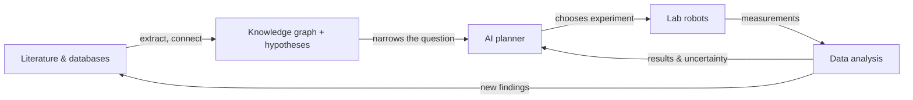

# Beginner

> *Plain-language overview. No coding required.*

This level explains what autonomous labs and literature synthesis are, why scientists are excited about them, and the vocabulary you'll see in every other chapter. If you can read a news article about science, you can read this section.

## What to read

- **[What is an autonomous lab?](autonomous-labs.md)** — the closed-loop idea, what the AI does, what the robots do.
- **[What is literature synthesis?](literature-synthesis.md)** — how AI helps researchers handle the firehose of papers.
- **[Glossary](glossary.md)** — every recurring term in one place.

## Why two halves

Autonomous labs **generate** new data by running experiments. Literature synthesis **organises** what we already know from papers and databases. A complete research-acceleration story uses both: read first, then experiment, then read again. This handbook treats them as siblings, not separate worlds.

## A picture of the whole thing

Read top-to-bottom: literature feeds the planner; the planner drives the robot; the robot's results update the planner *and* the literature. That loop is the unifying idea of this handbook.

## What this level does not cover

- How to write the code.
- The math behind the AI.
- How to operate the systems reliably.

Those live in the intermediate, PhD, and engineer levels. This level just makes sure the vocabulary and intuitions are solid before you go further.

## Honest framing

Autonomous labs are real but rare. Literature synthesis tools are widely used but easy to misuse. Neither replaces a scientist — they extend a scientist. Treat any product claim that promises more than that with skepticism.
