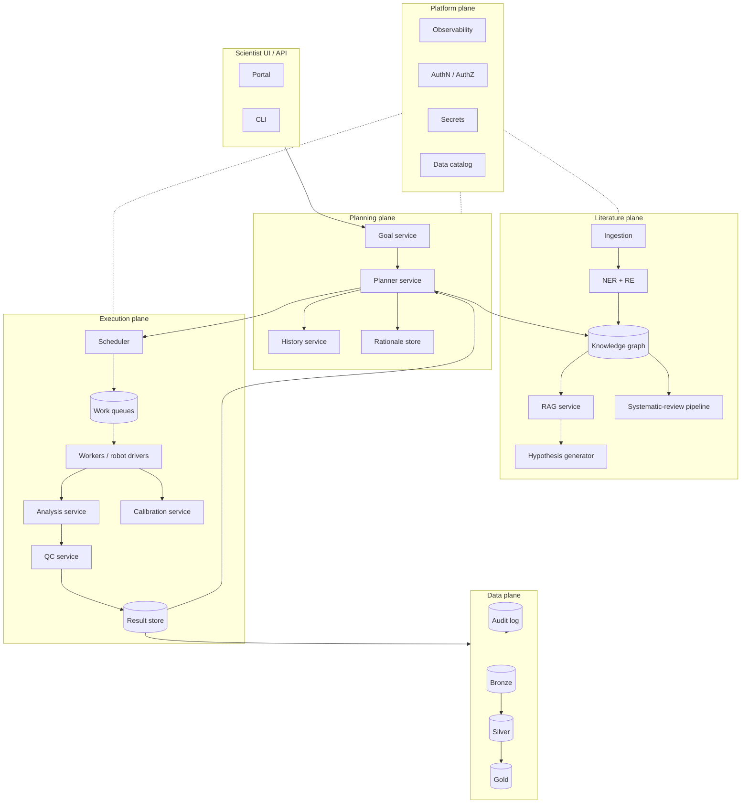

# Architecture

> *Services, contracts, data planes, and what runs where.*

A working autonomous-lab-plus-literature-synthesis platform is a small distributed system. This chapter is the reference architecture — what the components are, what each one owns, and where the contracts live.

## The whole picture



Five planes:

- **Planning plane** owns the next-experiment decision.
- **Literature plane** turns text into KG + RAG.
- **Execution plane** runs the experiment and turns the result into a metric.
- **Data plane** is the layered storage that everything else writes through.
- **Platform plane** is cross-cutting: auth, secrets, observability, catalog.

## Contracts, not implementations

The most important architectural decision is the *interface* between planes. Within a plane, you can change implementations. Across a plane, you cannot.

| Contract | Lives between | Form |
| --- | --- | --- |
| **Goal spec** | User → Planner | JSON schema; versioned. |
| **Experiment spec** | Planner → Scheduler | JSON schema; versioned. |
| **Result record** | Analysis → Planner | JSON schema; versioned; carries `qc_status`, `uncertainty`, versions of all upstream pieces. |
| **KG release** | Literature → consumers | Tagged, immutable; URI scheme controlled. |
| **RAG query / response** | Hypothesis & UI → RAG | Versioned; explicit citations contract. |

Versioning every contract is non-negotiable. A change without a version bump is how the planner silently learns garbage.

## Service decomposition

A small but real production system has at minimum these services:

| Service | Responsibility | Why separate |
| --- | --- | --- |
| **Goal service** | Stores and validates goals. | A goal is an artifact, not a config. |
| **Planner service** | Holds the model; exposes `propose`, `update`. | Replaceable backend (BO / RL / LLM agent). |
| **History service** | Append-only record of every proposal + result. | Source of truth for replay and audit. |
| **Rationale store** | Why each experiment was chosen. | Auditability. |
| **Scheduler** | Dispatches specs to workers, owns queues. | Decouples planner from worker availability. |
| **Worker pool** | Drives robots / runs analyses. | Scales horizontally; can be heterogeneous. |
| **Analysis service** | Computes the metric from raw measurements. | Versioned independently. |
| **QC service** | Decides which results enter the planner. | Independent enforcement. |
| **Calibration service** | Publishes current calibration versions; runs scheduled re-calibrations. | Calibration drives result interpretation. |
| **KG service** | Stores and serves the knowledge graph; tags releases. | Many consumers; immutability. |
| **RAG service** | Embedding + retrieval + rerank. | Used by hypothesis generator, UI, systematic-review pipeline. |
| **Hypothesis generator** | Produces and ranks candidate experiments. | Replaceable methods. |
| **Systematic-review pipeline** | PRISMA-compatible runs. | Periodic; durable. |
| **Result store** | Layered: bronze, silver, gold. | Reproducible analyses. |
| **Audit log** | Everything that touched everything. | Compliance and trust. |
| **Observability** | Metrics, logs, traces, alerts. | Cross-cutting. |

Whether each is a microservice, a module in a monolith, or a function in a notebook depends on scale. The *contracts* matter more than the deployment topology.

## Synchronous vs. asynchronous

| Operation | Pattern |
| --- | --- |
| `goal.create()` | Sync. Fast, validates the goal. |
| `planner.propose()` | Sync from caller; may take seconds. |
| `scheduler.submit()` | Sync return of a job ID; async execution. |
| `worker.run()` | Async; durations vary from minutes to days. |
| `analysis.compute()` | Async after raw measurements available. |
| `planner.update()` | Sync on event arrival. |
| `kg.ingest()` | Async, batched. |
| `rag.query()` | Sync, cached. |

The planner never blocks on the worker. The contract is a message queue with at-least-once delivery and idempotent receivers.

## Data plane: the medallion pattern

Same layout as data engineering (see [NeuroStack DWI case study](https://phindagijimana.github.io/neuro_stack/data-engineering/dwi-case-study/)):

- **Bronze** — raw measurements as they came off the instrument or the source database. Immutable.
- **Silver** — cleaned, normalised, calibrated. Schema enforced.
- **Gold** — feature-level / metric-level. Consumed by the planner and the UI.

The KG sits adjacent — it is its own gold-class artifact with its own release tags.

## State, time, and replay

A trustworthy platform supports *replay*: given an audit-log range and the artifacts pinned at that time, the same result must reproduce.

This shapes the architecture in three ways:

1. Every model, prompt, container image, calibration version is content-addressed.
2. Every result record carries pointers to those versions.
3. The result store accepts new results but never overwrites; reanalyses produce new records.

See [reproducibility](reproducibility.md) for the mechanics.

## Deployment topology

Typical real-world topology:

| Layer | Substrate |
| --- | --- |
| Worker pool (robot drivers) | On-prem near the instrument. Kubernetes node groups in the same building, or bare-metal workstations under a config-managed agent. |
| Worker pool (analysis) | Either on-prem GPU box for heavy imaging / training, or cloud GPUs for spiky workloads. |
| Planner, history, rationale, RAG, KG | Cloud or on-prem; stateful; backed up. |
| Observability | Cloud-hosted (Datadog, Honeycomb) or self-hosted (Grafana + Tempo + Loki). |
| Audit log | Append-only object storage with object-lock. |

The split between on-prem (close to instruments and patient data) and cloud (for elastic compute and managed services) is the dominant design choice in regulated science settings.

## Security boundaries

For systems that touch patient data:

- Patient identifiers never leave the de-identification boundary.
- KG ingestion strips PHI before indexing.
- RAG retrieval respects record-level access control.
- Audit log access requires its own role; not co-located with admin role.

See [safety & governance](safety-governance.md) for the regulatory framing.

## Failure domains

A useful exercise: list every component that, if it fails, takes the loop down.

| Component | Blast radius | Mitigation |
| --- | --- | --- |
| Planner service | Loop stops; no new specs. | Hot standby; cached last-N specs; manual override. |
| Scheduler | New runs blocked. | Hot standby; durable queues. |
| Worker | One run blocked. | Idempotent retry; re-dispatch. |
| Analysis | Backlog of pending results. | Idempotent; replay-able. |
| Calibration | All new results suspect. | Block the planner from updates; require human ack. |
| KG | RAG and hypothesis generation degraded. | Read-only mirror; staleness banner. |
| RAG | UI degraded; planner fine. | Cache; graceful fallback. |
| Audit log | Catastrophic compliance failure. | Multi-region replication; object-lock. |

A platform that hasn't done this exercise will discover the answers under fire.

## API style

The right API style: small, versioned, JSON. REST for control-plane operations (low rate, mutating, idempotent), event topics for the high-rate data-plane traffic.

Examples:

```
POST /v1/goals                    {goal spec}        → 201 with goal_id
POST /v1/proposals?goal_id=...    {}                 → 200 with spec + rationale_id
GET  /v1/proposals/{id}                              → spec, rationale, planner_version
POST /v1/results                  {result record}    → 201; planner.update event published
GET  /v1/kg/releases                                 → list of tagged releases
POST /v1/rag/queries              {query, top_k}     → ranked passages + citations
```

Each endpoint validates against a versioned schema. Old clients keep working until the version is retired.

## Honest warnings

- **Architecture astronauting wastes a year.** Start with the contracts and one service per plane; split when the seams hurt.
- **The contract is the architecture.** A clean diagram with sloppy schemas is sloppy architecture.
- **Latency-vs-correctness trade-offs surface late.** A pipeline that's "fast enough" in dev rarely is in prod under contention.
- **On-prem dependencies are real.** Robots, sensors, scanners all live near the building's network reality.

## Where to next

- [Orchestration](orchestration.md) — the scheduler in detail.
- [Observability](observability.md) — how you see what this thing is doing.
- [Reproducibility](reproducibility.md) — the versioning story end-to-end.
