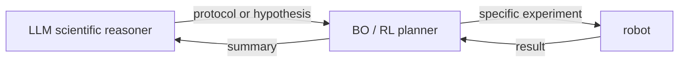
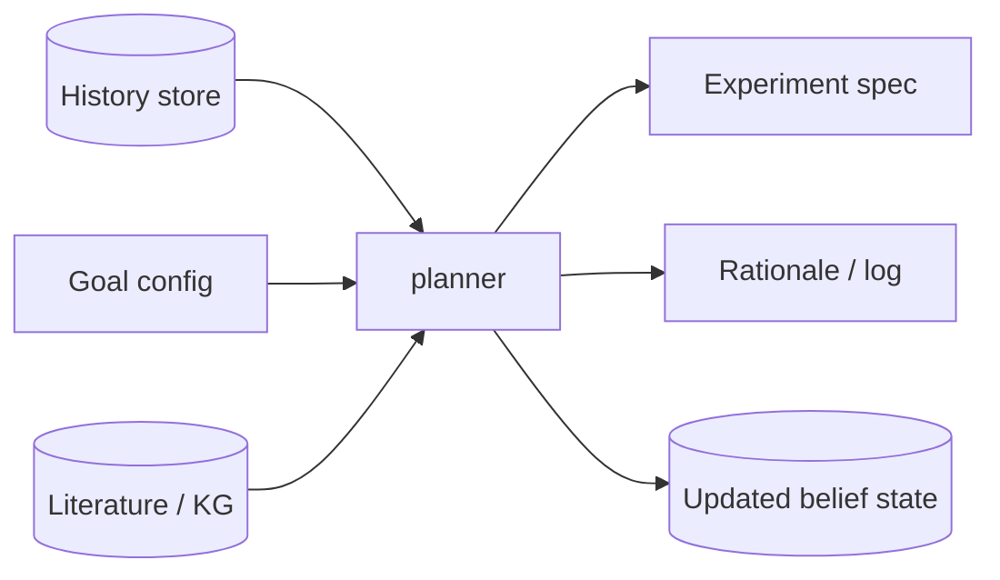

# AI planners

> *The component that decides what experiment to run next.*

The planner is the brain of an autonomous lab. Everything else exists to execute its decisions and feed back the results. There are four families of methods in production use today; each one solves a slightly different problem.

## What the planner has to do

Given:

- A **search space** $\mathcal{X}$ of possible experiments (molecules, conditions, doses, parameter settings).
- A **goal function** $f(x)$ — usually unknown, expensive to evaluate, sometimes noisy.
- A **history** of prior experiments and their outcomes.
- A **budget** (time, money, reagents, ethics).

The planner picks the next $x \in \mathcal{X}$ to run.

That's it. The methods differ in how they balance *exploring* (learn more about $f$) against *exploiting* (run something likely to be good).

## The four families

| Family | Idea | Best when |
| --- | --- | --- |
| Classical optimisation | Treat $f$ as a function to optimise with gradients or grid search. | $f$ is cheap, well-behaved, and you have good gradients. (Rare in labs.) |
| [Bayesian optimisation (BO)](../phd/bayesian-optimization.md) | Maintain a probabilistic guess at $f$; pick the next $x$ to maximise an *acquisition function*. | Each experiment is expensive and you can afford a small (10–1000) number of them. |
| [Reinforcement learning (RL)](../phd/reinforcement-learning.md) | Treat the lab as an environment; learn a policy that maps state to action. | The lab is large, has long-horizon decisions, and you can pre-train in simulation. |
| [LLM-based reasoning](../phd/llm-scientific-reasoning.md) | An LLM proposes experiments, conditioned on the literature and the history. | The search space is hard to formalise, or you want the planner to *justify* its choice. |

For most real labs today, Bayesian optimisation is the default. LLMs are increasingly used as a higher-level "scientific reasoner" *above* a BO loop, not as a replacement for it.

## Bayesian optimisation in five sentences

BO does two things in a loop:

1. **Surrogate model** — fit a Gaussian process (or other probabilistic model) to all your historical $(x, y)$ pairs, giving a *belief* about $f$ that includes uncertainty.
2. **Acquisition function** — for each candidate $x$, compute a number expressing how *worthwhile* sampling there is — combining "the surrogate thinks $f$ is high here" with "the surrogate is uncertain here".

Pick the $x$ with the highest acquisition. Run it. Update the surrogate. Repeat.

A common acquisition function: **expected improvement (EI)** — the expected amount by which $f(x)$ would beat the current best, integrated over the surrogate's uncertainty.

```python
from skopt import gp_minimize
from skopt.space import Real

space = [Real(0.0, 100.0, name="dose_mg"),
         Real(0.0, 1.0,   name="ph_offset")]

result = gp_minimize(
    func=run_experiment_and_return_loss,  # closes over the robot + analysis
    dimensions=space,
    n_calls=40,                            # 40 experiments total
    n_initial_points=8,                    # 8 random ones to seed the GP
    acq_func="EI",
)

print("best params:", result.x)
print("best loss:",   result.fun)
```

This is a real, runnable pattern. `gp_minimize` is part of `scikit-optimize`. The lab-flavoured version replaces `run_experiment_and_return_loss` with a function that submits to the robot queue and blocks on the result.

## When BO isn't enough

BO assumes one experiment at a time, one goal, and a search space where points are independent. Real labs often violate all three.

- **Batch BO.** You can run 96 experiments in parallel on a plate. *q-EI* and similar acquisition functions handle batches.
- **Multi-objective BO.** You care about both potency and toxicity. Use *Pareto-aware* acquisitions (e.g., expected hypervolume improvement).
- **Constrained BO.** Some $x$ are infeasible (concentration too high, reagent unavailable). Use constrained acquisitions or feasibility predictors.
- **Cost-aware BO.** Some $x$ are cheap and some are expensive. Acquisition / cost gives you a *bang per buck*.
- **Multi-fidelity BO.** You can run a cheap, noisy version of the experiment and an expensive, clean one. Pick the right level for each query.

All of these are well-studied. The [PhD chapter on Bayesian optimisation](../phd/bayesian-optimization.md) covers them.

## When to reach for RL

RL is heavier than BO. Reach for it when:

- Decisions have *sequential* effects (the order of experiments matters, not just the set).
- The state space is large (continuous parameters with structure).
- You can train policies in *simulation* before risking real reagents.

Examples: optimising long protocols for cell differentiation, choosing biopsy schedules in animal studies, planning multi-step organic synthesis.

For most labs, RL is still research, not production.

## LLM-based scientific reasoning

LLMs add three things that BO/RL don't:

- They read prior literature and incorporate it.
- They can produce *natural-language rationales* the scientist can review.
- They can plan over weird search spaces — e.g., "propose a protocol", not just "propose a parameter vector".

The pattern that's emerging:



The LLM thinks at the level of *strategies*; the BO loop optimises specific parameters within the strategy.

Caveats: hallucination, irreproducibility from sampling, and prompt sensitivity. See [PhD: LLM scientific reasoning](../phd/llm-scientific-reasoning.md).

## Where the planner lives in the system



A production planner is a service. It exposes:

- `propose(goal, history) -> spec, rationale`
- `update(spec, result) -> new_belief`
- A versioned model + config so you can reproduce a decision later.

See [engineer: architecture](../engineer/architecture.md) for the API design.

## Honest warnings

- **A BO loop with no calibration story will drift.** The surrogate believes the noisy data.
- **An LLM-based planner with no grounding will hallucinate experiments.** Sometimes physically impossible ones.
- **An RL agent trained only in simulation will fail in the real lab.** The sim-to-real gap is famous in robotics; it bites labs too.
- **A planner with no logged rationale is unauditable.** Always store the *why*.

## Where to next

- [Lab robotics](robotic-equipment.md) — what the planner is talking to.
- [PhD: Bayesian optimisation](../phd/bayesian-optimization.md) — the math.
- [PhD: LLM scientific reasoning](../phd/llm-scientific-reasoning.md) — language models as planners.
