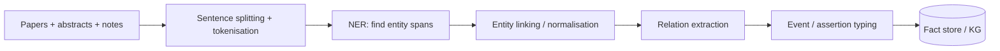

# Biomedical NLP

> *Pulling structured facts out of free-text papers, abstracts, and clinical notes.*

Biomedical NLP is the on-ramp for everything else in Part B. If the extraction is wrong, the knowledge graph is wrong, the hypotheses are wrong, the systematic review is wrong. This chapter is about getting the on-ramp right.

## The classic pipeline



Five stages, four of them imperfect. A modern biomedical-NLP system is essentially a careful pipeline of imperfect models with strict provenance on every span.

## NER — finding the entities

The model reads a sentence and tags spans like:

```
[DRUG]Phenytoin[/DRUG] is associated with [DISEASE]hippocampal sclerosis[/DISEASE]
in patients with [DISEASE]temporal lobe epilepsy[/DISEASE].
```

| Approach | Notes |
| --- | --- |
| Dictionary / regex | Fast, predictable; misses misspellings and novel terms. |
| BiLSTM-CRF (2017–2019) | Good baseline; small models; reasonable on standard benchmarks. |
| BioBERT / SciBERT / PubMedBERT | Fine-tuned BERT-family encoders; current default for production. |
| LLMs in zero/few-shot | Strong on rare entity types, but hallucinate; need verification. |

For a working pipeline, use a fine-tuned model (PubMedBERT or similar) as the workhorse, with dictionaries as a guard rail and an LLM only for rare types.

### Try it

```python
import scispacy
import spacy

nlp = spacy.load("en_core_sci_md")  # or en_core_sci_lg
doc = nlp("Phenytoin is associated with hippocampal sclerosis "
          "in patients with temporal lobe epilepsy.")
for ent in doc.ents:
    print(ent.text, ent.label_)
```

`scispacy` is a solid starting point. For production, switch to `medspaCy` or to a fine-tuned PubMedBERT NER head trained on BC5CDR or NCBI Disease.

## Normalisation / entity linking

NER gives you spans. Normalisation maps each span to a unique ID in a controlled vocabulary so that "TLE", "temporal lobe epilepsy", and "epilepsy, temporal lobe" all collapse to the same node.

The vocabularies that matter:

| Vocabulary | What it covers |
| --- | --- |
| **UMLS** | Cross-vocabulary umbrella for biomedical concepts. CUIs. |
| **MeSH** | Indexing terms for PubMed; coarse but reliable. |
| **SNOMED CT** | Clinical terminology; rich but licensed. |
| **HGNC** | Gene symbols. |
| **ChEMBL / DrugBank / RxNorm** | Drugs and chemicals. |
| **Mondo / DO / OMIM** | Diseases. |
| **Gene Ontology** | Biological processes, molecular functions, cellular components. |

Two patterns dominate normalisation:

1. **Lexical + alias matching** (e.g., `scispacy.linking.UmlsEntityLinker`). Fast, good baseline.
2. **Embedding-based** — embed the mention and the candidate concepts, pick the nearest neighbour. Handles paraphrase.

Always store the *original mention*, the *normalised ID*, and the *confidence*. Downstream consumers may need to lower the confidence threshold.

## Relation extraction

Given two normalised entities in a window of text, decide whether they're related and, if so, how.

Common relation types in biomedical text:

| Relation | Example |
| --- | --- |
| `inhibits(drug, protein)` | "Imatinib inhibits BCR-ABL." |
| `treats(drug, disease)` | "Levetiracetam treats focal epilepsy." |
| `associated_with(gene, disease)` | "BRCA1 is associated with breast cancer." |
| `causes(exposure, outcome)` | "Smoking causes lung cancer." |
| `part_of(structure, structure)` | "The CA1 region is part of the hippocampus." |

Methods:

| Method | Status |
| --- | --- |
| Rule-based templates | Old but interpretable. Used as guard rails. |
| BERT-family sentence classifiers | Standard production. |
| Distant supervision with knowledge bases | When labels are scarce. |
| LLM zero/few-shot | Increasingly viable for rare types; cost / hallucination tradeoffs. |

The state of the art on biomedical-RE benchmarks (BC5CDR, GAD, ChemProt, DrugProt) sits between fine-tuned PubMedBERT and prompted LLMs.

### Negation, hedging, speculation

Biomedical text is full of "*not* associated", "*may* indicate", "*could* be due to". A relation extracted without negation and hedge handling will mislead the graph.

Tools that handle these:

- **NegEx**, **ConText** (classic rules).
- **Modern transformer-based assertion classifiers** (positive / negated / speculated / conditional).

The output of relation extraction should always carry an *assertion type*, not just the relation.

## Event extraction

Sometimes the unit you want isn't a binary relation but an *event* with multiple roles. The BioNLP shared tasks (2009 onwards) defined this:

```
GENE_EXPRESSION
  theme: BRCA1
  location: breast tissue
  context: post-menopausal women
```

Event extraction is harder than relation extraction; production systems either avoid it or restrict it to a few high-value events.

## Document-level vs. sentence-level

Most older models work at the sentence level. But the meaningful facts often span sentences (or sections). Two trends:

- **Coreference resolution** — link "it", "the drug", "this protein" to their antecedents.
- **Document-level relation extraction** — use a long-context transformer to consider the whole document; aggregate evidence.

For abstracts, sentence-level is usually enough. For full text, document-level is increasingly the default.

## Evaluation

Public benchmarks worth knowing:

| Benchmark | What it covers |
| --- | --- |
| **BC5CDR** | Chemical / disease NER + relations. |
| **NCBI Disease** | Disease NER. |
| **BioASQ** | Question answering over biomedical literature. |
| **MedNLI** | Natural-language inference on clinical notes. |
| **EBM-NLP** | Population / Intervention / Comparison / Outcome extraction from RCT abstracts. |
| **DrugProt / ChemProt** | Drug–protein interaction relations. |

The standard hard truth: a model that's 0.85 F1 on a benchmark may be 0.60 on your in-the-wild text. Always validate on your domain.

## Honest warnings

- **Domain shift is everywhere.** A model trained on cancer abstracts performs worse on neurology notes.
- **Long-tail entities.** Brand-new gene names won't be in your linker for months.
- **Section heterogeneity.** Methods sections are different from Results, which are different from Discussion. Mixing them confuses everything.
- **PDF parsing.** Most papers are PDFs. Conversion to text is itself a source of errors. Tools: GROBID, marker, Nougat.
- **License terms.** Many full-text corpora are not free to redistribute. Cache, don't republish.

## Where to next

- [Knowledge graphs](knowledge-graphs.md) — what NER + RE feeds.
- [PhD: relation extraction](../phd/relation-extraction.md) — the model architectures.
- [Systematic-review support](systematic-review.md) — what NLP looks like at PRISMA scale.
