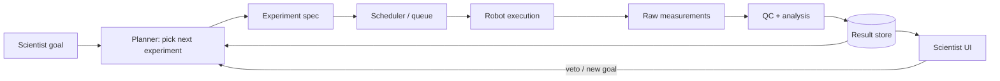

# Closed-loop systems

> *What "closed" really requires, and why most "autonomous labs" aren't fully closed yet.*

A closed-loop lab is the diagram everyone draws. The interesting work is in what that diagram glosses over.

## The diagram, expanded



Notice three things the simple version hides:

1. There's a **scheduler** between the planner and the robot — experiments don't run instantly.
2. There's a **QC step** between the raw measurements and the analysis — most measurements need calibration, normalisation, outlier rejection.
3. There's a **scientist UI** with veto power — fully autonomous loops are rare; supervised loops are normal.

## What "closed" means at each loop boundary

| Boundary | Closed if… | Common openings |
| --- | --- | --- |
| Planner → spec | The spec is machine-executable, not free text. | Planner outputs prose that a human has to translate. |
| Spec → robot | The scheduler picks reagents, calibrations, and a runnable program automatically. | Operator manually loads consumables. |
| Robot → raw | Measurements stream into a known location with metadata. | Files dumped onto a shared drive without provenance. |
| Raw → analysis | QC and analysis run automatically with deterministic versions. | Human runs an ImageJ macro at the end of the week. |
| Analysis → planner | Results come back in time for the next planning cycle. | Results land days later; planner has moved on. |

A lab is "closed" only at the slowest weakest boundary. If any one of these is a manual step that takes a week, the loop's cadence is a week.

## Time scales

The single biggest design decision is the loop's *cadence*.

| Loop cadence | Typical context |
| --- | --- |
| Seconds | Chemistry on a flow reactor with in-line spectroscopy. |
| Minutes | Microfluidic screens with optical readout. |
| Hours | Cell-based assays with imaging. |
| Days | Animal models, organoids, sequencing-based readouts. |
| Weeks | Anything requiring tissue prep, behavioural training, or surgery. |

Most neuroscience experiments live at "days" or worse. That doesn't kill the loop, but it changes the planner — long-cadence loops benefit more from picking *informative* experiments (active learning) than from running many of them (exploit).

## Throughput vs. autonomy

People conflate two ideas:

- **Throughput** — how many experiments per unit time you can physically run.
- **Autonomy** — how many cycles of plan → run → learn → plan happen without a human.

A 1536-well plate run by a robot has high throughput and low autonomy. A 5-experiments-a-week closed loop with reinforcement learning has the opposite. The biggest leverage usually comes from autonomy, because the planner's gain compounds across cycles, while throughput is linear.

## State that the loop must remember

A closed loop is a stateful system. At minimum it remembers:

- Every experiment ever proposed, with the planner version that proposed it.
- Every experiment actually run, with the robot's audit log.
- Every measurement, with calibration metadata.
- Every analysis output, with the analysis version that produced it.
- The planner's evolving belief state (a model, a posterior, an embedding).

If any of these is missing, you cannot reconstruct *why* an experiment was chosen, and you lose the audit trail that makes the system trustworthy.

See [engineer: reproducibility](../engineer/reproducibility.md) for the structures that hold this.

## When the loop breaks

Real failure modes, from the field:

- **Robot drift.** Pipette calibration degrades; results creep without obvious failure. The planner happily learns from corrupted data.
- **Reagent depletion.** The recipe assumes 1 mL; only 0.5 mL is left. Robot runs a half-experiment. QC may not catch it.
- **Concept drift.** A new batch of cells responds differently. The model's prior is now wrong; learning is now confused.
- **Stuck loops.** The planner keeps proposing the same region. Acquisition function is poorly tuned.
- **Silent stops.** The scheduler quietly stalls because a worker died. No one notices for 18 hours.

Every one of these is an *operations* problem, not a science problem. They're treated in [engineer: observability](../engineer/observability.md).

## A minimal Python sketch

A toy planner-loop, in deliberately ugly pseudocode, to make the structure concrete:

```python
state = load_state()        # belief + history
goal  = load_goal()

while not goal.satisfied(state):
    spec   = state.planner.propose_next(goal)         # AI planner
    job    = scheduler.submit(spec)                    # to the robot queue
    raw    = job.wait_for_result(timeout="2h")         # blocks; may fail
    if raw is None:
        observability.alert("job_timeout", spec)
        continue
    clean  = qc.run(raw, spec.calibration)             # may reject
    result = analysis.run(clean, spec.assay)
    state.history.append((spec, result))
    state.planner.update(spec, result)                 # the "learning" step
    state.save()
```

The hard parts are not in the loop itself; they are in `propose_next`, `qc.run`, `analysis.run`, and the operational story for `job.wait_for_result` failing. Each of the rest of the intermediate chapters expands one of those.

## Where to next

- [AI planners](ai-planner.md) — the part that picks `spec`.
- [Lab robotics](robotic-equipment.md) — the part that runs `spec`.
- [Experiment data analysis](data-analysis.md) — the part that turns `raw` into `result`.
- [Engineer: orchestration](../engineer/orchestration.md) — the part that makes `scheduler.submit` reliable.
