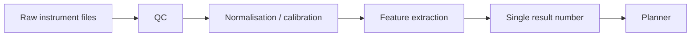

# Experiment data analysis

> *Turning raw measurements into the number the planner will believe.*

The planner takes a single number (or a small vector) per experiment. Producing that number reliably is most of the engineering. This chapter covers the path from raw instrument output to a clean, comparable, *trustable* result.

## The shape of the problem



Each box has its own failure modes, and each box must be **versioned** so that a result from June can be compared to a result from December. If the analysis code changes silently mid-loop, the planner is now learning a moving target.

## What the readouts look like

| Readout | Raw form | What you usually want |
| --- | --- | --- |
| Plate reader luminescence | 96 / 384 / 1536 numbers per plate | Z-score vs. controls, IC50, EC50. |
| Imaging | Stacks of TIFF / OME-TIFF / HDF5 | Cell count, viability fraction, neurite length. |
| Sequencing | FASTQ, BAM | Read counts per gene; expression deltas. |
| Mass spec | mzML | Peak intensities; compound IDs. |
| Electrophysiology | Continuous voltage traces | Firing rate, burst properties. |
| MRI (in neuroscience contexts) | DICOM / NIfTI | Volumes, contrasts, biomarker scores. |

If you've read the [NeuroStack data-engineering chapter](https://phindagijimana.github.io/neuro_stack/data-engineering/), you've already seen what a real, layered pipeline looks like for one of these. The same pattern transfers.

## QC: the unglamorous half

Before the analysis runs, the pipeline answers three questions:

1. **Is the input what we think it is?** Plate-map ID matches; cell-line ID matches; reagents within shelf life.
2. **Is the input usable?** Plate edges weren't contaminated; no autofocus failure; no missing wells.
3. **Are the controls behaving?** Positive and negative controls produce expected signal.

If any answer is *no*, the result does not go to the planner. It goes to an *anomalies* queue with enough metadata to investigate.

A robust pipeline rejects 5–20% of runs in normal operation. If you're rejecting nothing, your QC is broken.

## Normalisation

Two patterns dominate:

### Plate-level normalisation

Use the on-plate controls to put every well on a comparable scale.

```python
import numpy as np

def plate_normalize(wells, pos_idx, neg_idx):
    pos = np.mean(wells[pos_idx])
    neg = np.mean(wells[neg_idx])
    return (wells - neg) / (pos - neg)   # 0 = neg, 1 = pos
```

A scale change between Monday and Friday becomes invisible to the planner.

### Batch / site correction

Across plates, days, or instruments, a confounder will sneak in. The neuroimaging community calls this *site effects*; assay biology calls it *batch effects*. Methods include ComBat (used for neuroimaging — see [NeuroStack evaluation](https://phindagijimana.github.io/neuro_stack/ai/evaluation/)), median-polish, and quantile normalisation.

For a closed loop, the rule is: choose the correction method once, version it, and never silently switch.

## Feature extraction

Turn the cleaned signal into the few numbers the planner will see.

| Modality | Common features |
| --- | --- |
| Plate reader | IC50, EC50, Hill slope, maximum effect. |
| Imaging | Cell count per well, mean intensity, fraction of viable cells, neurite length, morphology PCs. |
| Sequencing | Differential expression magnitude in a target gene set. |
| Electrophysiology | Firing rate, ISI variability, burst index. |
| MRI | Volumetrics, asymmetry indices (see HS case study). |

These should be deterministic given the raw input. If your feature extraction uses a deep model, that model needs a frozen checkpoint and a version string.

## The single result number

The planner consumes a small object:

```json
{
  "experiment_id": "exp-2026-06-16-0042",
  "metric": "viability_normalized",
  "value": 0.71,
  "uncertainty": 0.04,
  "qc_status": "pass",
  "analysis_version": "v3.2.1",
  "calibration_version": "2026-06-16-am"
}
```

Three details matter:

- **`uncertainty`** — the planner should know how confident the number is. A noisy result should be treated differently than a clean one.
- **`qc_status`** — `pass`, `pass-with-flag`, or `fail`. Failed results never update the surrogate; flagged results update with reduced weight.
- **Versions** — analysis and calibration versions are pinned. A later replay must produce the same number.

## Wiring it into the loop

```python
def analyze_and_report(raw_files, spec):
    if not qc.check(raw_files, spec):
        return {"qc_status": "fail",
                "reason": qc.last_failure()}
    cleaned   = normalise(raw_files, spec)
    features  = extract_features(cleaned, spec)
    metric    = features[spec.metric]
    uncertain = features[spec.metric + "_uncertainty"]
    return {
        "experiment_id":       spec.experiment_id,
        "metric":              spec.metric,
        "value":               float(metric),
        "uncertainty":         float(uncertain),
        "qc_status":           "pass",
        "analysis_version":    ANALYSIS_VERSION,
        "calibration_version": current_calibration_version(),
    }
```

The planner's `update(spec, result)` then takes this dict.

## Reuse vs. write your own

For the standard readouts, reach for the standard libraries first:

| Domain | Library |
| --- | --- |
| Image analysis | scikit-image, CellProfiler, napari, MONAI for medical. |
| Plate / assay analysis | pyAssayTools, in-house notebooks (most labs). |
| Sequencing | bcbio-nextgen, nf-core, DESeq2, edgeR (R). |
| Mass spec | MZmine, OpenMS. |
| Electrophysiology | SpikeInterface, MNE-Python (for EEG/MEG). |
| Neuroimaging | FSL, FreeSurfer, ANTs, QSIPrep — see [NeuroStack fundamentals](https://phindagijimana.github.io/neuro_stack/fundamentals/). |

Write custom code only where the library doesn't fit. Custom code is debt; it has to be maintained.

## Honest warnings

- **Silent feature drift.** A field-of-view crop changed; your cell-count feature changes; the planner re-learns. Audit feature definitions.
- **Forgotten controls.** A run with no positive control produces a number; the number is meaningless; the planner doesn't know.
- **Confounding by plate position.** Edge effects in 384-well plates are real. Randomise your conditions.
- **Models for analysis that change without a version bump.** Worse than no model.

## Where to next

- [Closed-loop systems](closed-loop.md) — back to the parent diagram.
- [PhD: case study — hippocampal sclerosis](../phd/case-study-hs.md) — analysis pipeline for MRI biomarkers driving a research loop.
- [Engineer: reproducibility](../engineer/reproducibility.md) — versioning analysis, calibrations, and reagents.
