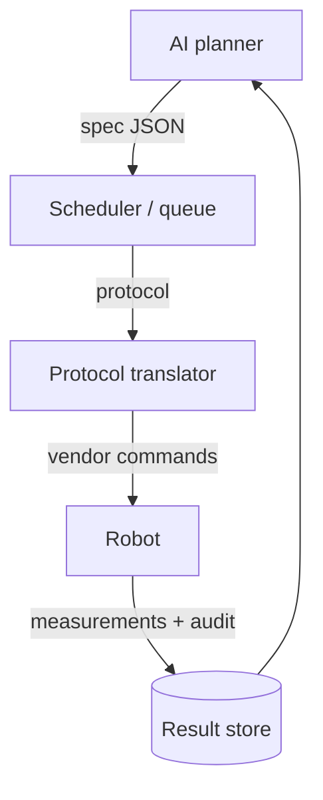

# Lab robotics

> *What real hardware does, what it doesn't, and the software layer that makes it usable.*

The glossy autonomous-lab videos show robotic arms gliding between instruments. The reality is dozens of small machines, half of which need a careful operator and most of which talk over different protocols. This chapter is about that reality.

## The classes of hardware

| Class | What it does | Typical vendors |
| --- | --- | --- |
| **Liquid handlers** | Move precise volumes between wells, tubes, plates. | Opentrons, Hamilton, Tecan, Beckman. |
| **Plate readers** | Optical / fluorescence / luminescence readout from microplates. | BMG, Tecan, Molecular Devices. |
| **Imagers** | High-content imaging of wells (often with confocal capability). | PerkinElmer Opera, Yokogawa CV8000. |
| **Incubators** | Hold cells at controlled temp / CO2; some are robot-accessible. | Liconic, Cytomat. |
| **Synthesis platforms** | Build molecules — flow chemistry rigs, parallel synthesisers. | Chemspeed, Vapourtec. |
| **Sequencing prep** | NGS library prep, including normalisation and pooling. | Beckman Biomek, Hamilton Star. |
| **Assays** | Kinase, ELISA, qPCR, etc. — usually a kit + plate reader. | Many. |
| **Robotic arms** | Move plates between the above. | Universal Robots (UR5/UR10), PreciseFlex. |
| **Schedulers / orchestrators** | Sit on top and coordinate. | Cellario, Green Button Go, Biosero. |

A lab might use one of each, or three of the same kind in parallel. The orchestrator is the only thing that turns "many machines" into "one lab".

## What a real protocol looks like

A "simple" cell-viability screen, end-to-end:

1. Pull cells from the incubator robot arm.
2. Seed cells into a 384-well plate via the liquid handler.
3. Incubate 24h.
4. Add compound dilutions from a source plate (different liquid handler).
5. Incubate 48h.
6. Add CellTiter-Glo reagent.
7. Read luminescence in the plate reader.
8. Transfer the plate to a barcode/archive position.

Twelve hardware interactions. Two days. One missed `barcode-scan` and the plate is unknown.

## How the planner talks to the hardware

You almost never want the planner directly driving robots. The standard stack:



Three pieces deserve more attention.

### The spec

The planner produces a *device-agnostic* spec — what to do, not how. Roughly:

```json
{
  "experiment_id": "exp-2026-06-16-0042",
  "protocol": "dose_response",
  "compound": "BAY-12345",
  "doses_uM": [0.01, 0.1, 1.0, 10.0],
  "cell_line": "SH-SY5Y",
  "incubation_h": 48,
  "readout": "celltiter_glo_luminescence"
}
```

The spec is what the planner records. It is what makes runs comparable later.

### The protocol translator

The translator turns the spec into vendor-specific commands. There is no universal standard yet; in practice you write per-vendor adapters.

Common formats and frameworks:

| Format / framework | Used for |
| --- | --- |
| **SiLA 2** | A device-driver standard, slowly being adopted. |
| **PyLabRobot** | Open-source Python layer over many liquid handlers. |
| **Opentrons Python API** | Protocol scripting for Opentrons OT-2 / Flex. |
| **AnIML / SBOL** | Data and design exchange formats for biology. |
| **Vendor-specific SDKs** | Almost every other vendor; usually Windows, often COM. |

Reality: you build a thin adapter per device, and an integration test that runs a *dry* protocol on a real plate. Without the dry-run check, you discover problems with reagents in the well, not in CI.

### Audit and provenance

Every action by every robot should write to an audit log: which plate, which well, which volume, which calibration version, which timestamp. The audit log is what lets you re-derive a result when a paper reviewer asks "are you sure?"

## Where things go wrong (in practice)

The ten most common operational failures in labs that have tried to go autonomous:

1. **Tip pickups fail.** Robots try to grab a tip; the rack has shifted by 1 mm; the run aborts silently.
2. **Calibration drift.** Pipettes deliver 9.8 µL instead of 10 µL. Results creep.
3. **Reagent quality varies.** Batch B of an antibody behaves differently from batch A. Loops can't see batch.
4. **Plate stacker jams.** A plate seats half-in. Subsequent moves crash.
5. **Cells contaminate.** Mycoplasma, mould; assays look "off" without an obvious culprit.
6. **Network drops.** The vendor app loses its license server briefly; the protocol pauses.
7. **Camera focus drifts.** Imager autofocus latches onto a particle; whole plate is out of focus.
8. **Power events.** Brownouts reset incubators; cells lose log-phase.
9. **Operator interventions.** Well-meaning humans top up a reagent without telling the system.
10. **Schedule contention.** Two protocols want the plate reader at the same minute.

You cannot eliminate these. You build for them: idempotent retries (where physical reality allows), conservative timeouts, sentinels in unused wells, daily calibration runs, and explicit human-confirmation gates. See [engineer: observability](../engineer/observability.md).

## A small Opentrons example

A working Opentrons protocol that the planner can emit. This is short enough to read in full.

```python
from opentrons import protocol_api

metadata = {"apiLevel": "2.15"}

def run(protocol: protocol_api.ProtocolContext):
    plate    = protocol.load_labware("nest_96_wellplate_200ul_flat", 1)
    tiprack  = protocol.load_labware("opentrons_96_tiprack_300ul", 2)
    src      = protocol.load_labware("nest_12_reservoir_15ml",      3)
    pip      = protocol.load_instrument("p300_single_gen2", "right",
                                        tip_racks=[tiprack])

    doses = [10, 30, 100, 300]  # µL of compound stock
    for i, vol in enumerate(doses):
        pip.transfer(
            vol,
            src["A1"],
            plate.wells_by_name()[f"A{i+1}"],
            new_tip="always",
        )
```

In a real autonomous lab, this script is *generated* by the protocol translator from the planner's JSON spec, not written by a human. The translator owns the labware-positions table; the planner owns the *what*, not the *where*.

## Where to next

- [Experiment data analysis](data-analysis.md) — what the plate reader's raw output becomes.
- [Engineer: orchestration](../engineer/orchestration.md) — how the scheduler keeps all this honest.
- [Engineer: safety & governance](../engineer/safety-governance.md) — biosafety, chemical safety, audit obligations.
