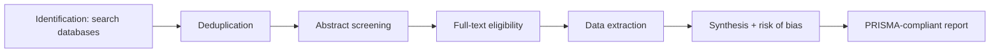

# Systematic-review support

> *AI inside the workflow that produces the most trusted form of biomedical evidence.*

A **systematic review** is the highest-rigor literature summary in medicine. Done by hand, a single review takes a team six to eighteen months. AI tools don't replace the rigor — they accelerate the mechanical steps so the team can spend its limited hours on judgement.

## The PRISMA pipeline

The dominant standard is PRISMA (Preferred Reporting Items for Systematic Reviews and Meta-Analyses). It defines the *process*: identification, screening, eligibility, inclusion, synthesis.



AI plugs in at every stage.

## Identification

The team writes a search string covering every database that might have relevant papers — PubMed, Embase, Cochrane Central, Web of Science, sometimes Scopus or clinical-trial registries. The same query, syntax-translated per database, returns thousands or tens of thousands of records.

AI-assisted tasks:

- **Query expansion.** Suggest synonyms, MeSH terms, drug brand names, anatomical variants.
- **Translation between databases.** PubMed's query language is not Embase's.
- **Coverage diagnostics.** Detect that "FCD type IIb" is excluded if the query only says "focal cortical dysplasia".

## Deduplication

Records arrive with overlapping titles, slight metadata differences, and inconsistent author lists. Naive string matching misses 20–40% of duplicates. Embedding-based duplicate detection is now standard:

```python
import numpy as np
from sentence_transformers import SentenceTransformer

model  = SentenceTransformer("allenai-specter")
titles = [r["title"] + ". " + r["abstract"] for r in records]
emb    = model.encode(titles, normalize_embeddings=True)

# pairwise cosine; flag pairs above threshold
sim = emb @ emb.T
np.fill_diagonal(sim, 0)
duplicates = np.argwhere(sim > 0.95)
```

A score above ~0.95 is a near-duplicate; the team confirms before deletion. The audit log keeps the rejection reason.

## Abstract screening

This is where AI saves the most human-hours. From, say, 8,000 abstracts, the team must keep a few hundred for full-text review.

Common patterns:

- **Active learning.** The team labels a seed of ~200 abstracts; a classifier is trained; remaining abstracts are ranked by predicted relevance; the team labels the top of the ranking first. The "stopping point" is when the rate of new includes per labelled abstract drops below a threshold.
- **LLM screening with strict prompts.** Increasingly used; *only* with human verification on at least a sample.

Tools used in published reviews:

| Tool | Role |
| --- | --- |
| **ASReview** | Open-source active-learning screening. |
| **Rayyan** | Commercial / freemium; widely used. |
| **DistillerSR** | Commercial, enterprise. |
| **Covidence** | Commercial; integrated with Cochrane workflow. |
| **EPPI-Reviewer** | Long-running tool from UCL. |
| **RobotReviewer** | RCT-specific risk-of-bias prediction. |

PRISMA mandates that every excluded paper has a reason. AI tools must log the reason — not just the decision.

## Full-text eligibility

A smaller pile, deeper read. AI helps less here, but still:

- **PDF parsing.** GROBID, Nougat, marker — extract structured text from PDFs.
- **Section detection.** Pull out Methods, Results, Population, Intervention.
- **Population / intervention / comparator / outcome (PICO) extraction.** EBM-NLP fine-tuned models do this.

A common mistake: trusting LLM-extracted PICOs without spot-checking. They are good but not perfect.

## Data extraction

For each included paper, fill the same table: study design, sample size, intervention, comparator, primary outcome, effect size, confidence interval, follow-up duration, risk of bias.

AI tasks:

- **Numerical extraction.** Pull the effect size, sample size, and CI from the Results section. Verify against the abstract.
- **Risk-of-bias scoring.** RobotReviewer and similar tools predict per-item risk of bias for RCTs.
- **Heterogeneity flagging.** Identify studies whose populations or interventions differ enough to warrant subgroup analysis.

The output is a spreadsheet (or, better, a structured database) the team can review.

## Synthesis and reporting

Once the table is built:

- **Meta-analysis.** Pool effect sizes with random-effects or fixed-effects models. AI is not the actor here; statistical software is (R `meta`, `metafor`; Python `statsmodels`, `pymeta`). AI can help draft the *narrative*.
- **Forest plots, funnel plots.** Drawn from the extracted table.
- **Risk-of-bias summaries.** Aggregated across studies.
- **Living review.** A pipeline that re-runs the whole process when new papers appear, surfacing new evidence to the team.

Living reviews are increasingly practical because AI handles the per-paper effort. Cochrane has experimented with them in COVID-19 evidence summaries.

## A worked example: hippocampal sclerosis post-surgery outcomes

Suppose you want to summarise: *in adults with drug-resistant temporal lobe epilepsy and confirmed hippocampal sclerosis, what is the seizure-freedom rate at 12 months after anterior temporal lobectomy?*

A working pipeline:

1. **Identification.** Search PubMed + Embase + Cochrane for "(hippocampal sclerosis) AND (temporal lobectomy) AND (seizure-freedom OR Engel)" — 4,200 records.
2. **Dedup** to ~2,900 unique.
3. **Active-learning screening.** Seed of 100 labelled; classifier ranks the rest; human reviewers go through the top ~600 and stop when no new includes appear over 50 sequential abstracts. Result: ~140 included.
4. **Full-text eligibility.** PDFs parsed, PICOs extracted, ~80 papers eligible.
5. **Data extraction.** Effect sizes (12-month Engel I rates), sample sizes, confidence intervals, MRI definition of HS, follow-up duration, complication rates.
6. **Risk-of-bias scoring** using a domain-specific tool.
7. **Synthesis.** Random-effects meta-analysis. Pool estimate of seizure freedom at 12 months. Subgroup by paediatric / adult; by unilateral / bilateral HS.
8. **Living-review job.** Each month, re-run identification with a date filter, surface newly relevant papers, request team review.

Total team time: weeks instead of months. Quality: comparable to a hand review, *if* the team verified each AI step.

## Evaluating the AI parts

The acceptable benchmarks for AI-assisted systematic reviews (per Cochrane's guidance):

- Recall must be very high on the *include* class — missing relevant papers is the worst failure.
- Precision can be lower — false positives just mean an extra abstract gets read.
- The decision boundary should be human-controllable.

A practical rule: target ≥95% recall at the screening step; accept whatever precision comes with it.

## Honest warnings

- **PRISMA compliance is not optional.** If your pipeline can't produce the PRISMA flow diagram (records identified, removed, screened, included), it's not a systematic-review pipeline.
- **Reviewer disagreement.** Two human reviewers always disagree; AI replicates whichever side it trained on. Document the resolution process.
- **Publication bias.** AI can't fix what isn't in the database. Use funnel plots; consider grey-literature inclusion.
- **Living reviews need governance.** Who is on the team this month? Who signs off when a new study changes the pool estimate?

## Where to next

- [PhD: relation extraction](../phd/relation-extraction.md) — the heavier NLP that supports extraction at scale.
- [PhD: RAG systems](../phd/rag-systems.md) — for living-review pipelines.
- [PhD: case study — hippocampal sclerosis](../phd/case-study-hs.md) — the worked example, in depth.
- [Engineer: reproducibility](../engineer/reproducibility.md) — running this pipeline every month without drift.
