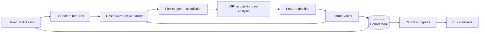

# Case study — hippocampal sclerosis

> *Both halves of AutoLabs applied end-to-end to a single research question.*

Most chapters in this handbook explain one component. This chapter follows one neuroscience question through the whole stack — from the literature graph that frames it, through the imaging analysis that scores subjects, to the planner that picks the next experiment.

The question:

> *In drug-resistant temporal-lobe epilepsy, which MRI-derived hippocampal asymmetry features best predict 12-month seizure freedom after anterior temporal lobectomy, and how should an MRI biomarker discovery experiment be designed?*

This is a real, working-day-of-a-research-engineer question — the kind a graduate student or junior PI might bring to the lab. We use it to integrate the rest of the handbook.

## Stage 0 — frame the question with literature synthesis

Before any experiment runs, the literature pipeline narrows the question.

### Search and retrieve

The systematic-review pipeline (see [intermediate: systematic-review](../intermediate/systematic-review.md)) is launched with a query:

```
("hippocampal sclerosis" OR "mesial temporal sclerosis")
AND ("temporal lobectomy" OR "ATL" OR "amygdalohippocampectomy")
AND ("seizure freedom" OR "Engel I" OR "ILAE 1")
```

Run across PubMed, Embase, Cochrane Central, ClinicalTrials.gov. After deduplication, ~2,900 records.

### Screen

ASReview-style active-learning screening narrows to ~150 included papers and ~30 high-value cohort studies / RCTs / meta-analyses. The PRISMA flow is preserved automatically.

### Extract a structured table

For each included study, a relation-extraction + PICO-extraction pipeline (see [PhD: relation extraction](relation-extraction.md)) produces rows:

| PMID | Sample size | Imaging | Asymmetry definition | Outcome | 12-mo Engel I % | CI |
| --- | --- | --- | --- | --- | --- | --- |
| 12345678 | 142 | 3T T1+FLAIR | Volume asymmetry index, threshold 0.10 | Engel I | 71% | 64–78 |
| ... | ... | ... | ... | ... | ... | ... |

The extractor must handle negation and uncertainty assertions — papers that *suggest* a threshold are tagged differently from those that *report* one.

### Build the focused KG

A KG slice (see [PhD: KG construction](kg-construction.md)) is built around HS:

- Nodes: *Brain region* (hippocampus subfields), *imaging feature* (volume, T2 hyperintensity, FLAIR asymmetry, diffusion metrics), *histopathology grade*, *seizure laterality*, *surgical procedure*, *outcome*, *cohort study*.
- Edges: `MEASURED_BY`, `ASSOCIATED_WITH`, `PREDICTS`, `REPORTED_IN`.

Every edge cites the supporting PMIDs.

### Surface the gaps

Two patterns emerge:

1. **Asymmetry thresholds vary widely** across studies — 0.06 to 0.20 — and choice of threshold strongly affects predictive performance.
2. **Paediatric cohorts are under-represented.** Most outcome data come from adults.

The first finding is the research question's *opportunity*. The second is a *limitation* the research-engineer should plan for.

### Generate candidate hypotheses

A hypothesis generator (see [intermediate: hypothesis generation](../intermediate/hypothesis-generation.md)) proposes candidate predictive features, each with a rationale and citations:

- **Volumetric asymmetry index (AI), with site-specific threshold.** Most-cited.
- **T2 / FLAIR signal asymmetry within CA1.** Several recent studies suggest it adds independent signal.
- **Diffusion metrics (mean diffusivity asymmetry) in the head of the hippocampus.** Smaller literature; possibly stronger in paediatric cases.
- **Surface-based morphometry of the subiculum.** Few studies; cited as a frontier.

This list becomes the search space for the experimental loop.

## Stage 1 — the MRI analysis pipeline

We need to compute these features reliably from raw MRI for each subject in our cohort. This is a heavy data-engineering step.

### The pipeline shape

```
BIDS sub-XXX ──► T1 + FLAIR + DWI preprocessing ──► HippUnfold subfield seg ──┐
                                                                              ├─► Feature CSV
              ──► QC ────────────────────────────────────────────────────────► QC report
```

Borrowing the medallion layout from [NeuroStack's DWI case study](https://phindagijimana.github.io/neuro_stack/data-engineering/dwi-case-study/):

- Bronze: raw DICOM → NIfTI + BIDS layout.
- Silver: per-subject preprocessing — bias correction, registration, segmentation (HippUnfold for subfields), DWI metrics.
- Gold: per-subject feature vector — left/right volumes, AI, T2 signal asymmetry, MD asymmetry, surface metrics.

Each step is versioned: container image hash, parameter set, software version. Calibration via a small **phantom** dataset is run weekly.

### Feature definition

A single subject's feature row is the planner's input:

```json
{
  "subject_id": "sub-001",
  "AI_volume_HC":           0.13,
  "AI_volume_subiculum":    0.10,
  "AI_volume_CA1":          0.18,
  "AI_T2_HC":               0.07,
  "AI_FLAIR_HC":            0.09,
  "AI_MD_HC_head":          0.05,
  "qc_status":              "pass",
  "pipeline_version":       "v2.4.1",
  "calibration_version":    "2026-06-13"
}
```

Features that fail QC are excluded from the planner.

## Stage 2 — what is the "experiment"?

In wet biology, an experiment is a robot run. Here, the "experiments" are *acquisitions or analyses* with budget constraints:

- Additional MRI scans on cohort subjects (a few hundred dollars and time per scan).
- Re-running analyses with different software versions.
- Acquiring a different MRI sequence (DWI multi-shell, qT2).
- Re-segmenting with a competing pipeline (FreeSurfer vs HippUnfold) to assess robustness.
- Recruiting an additional paediatric subject.

Each has a cost; the planner is a cost-aware active learner (see [PhD: active learning under constraints](active-learning.md)).

### The planner's job

Given:

- A **search space** of (subject, feature-set, acquisition-or-analysis) tuples.
- A **goal** — find the smallest feature set that predicts 12-month seizure freedom with AUROC ≥ 0.85.
- A **belief** — a probabilistic model of the feature-to-outcome mapping (a small GP regression, or a Bayesian logistic regression).
- A **cost** model — scanning costs, recruitment costs.
- **Constraints** — IRB-approved subject pool; safety; equity (paediatric cohort under-sampled, intentionally up-weighted).

The planner picks the next 5 subject-acquisition pairs per week.

### Concretely

```python
def propose_next_batch(state, budget=5):
    candidates = state.candidate_actions()
    candidates = filter_consent_and_safety(candidates, state)

    scored = []
    for x in candidates:
        info_gain = expected_info_about_goal(x, state)
        c         = cost(x, state)
        equity_w  = equity_weight(x, state)         # up-weight paediatric
        scored.append((x, info_gain * equity_w / c))

    batch = diversify(top_k(scored, budget*3), k=budget)
    return batch
```

`expected_info_about_goal` does the work; it's a posterior-information acquisition over the model's belief about the predictive AUROC, not just over the regression coefficients.

### Feedback

After each subject is acquired and analysed:

```python
state.update(action, observation)
state.audit()    # surrogate calibration, drift
```

Calibration audits compare the model's predicted AUROC distribution against held-out subjects. Drift triggers a human review.

## Stage 3 — the loop, end-to-end



The loop's cadence is *weekly*: each week's MRI sessions are picked Friday for the following Monday. The KG side updates monthly: new papers ingested, new hypotheses surfaced.

## Stage 4 — what good looks like

After ~12 weeks of looped experimentation:

- A held-out cohort of 30 subjects is used for final validation.
- The model predicts 12-month Engel I outcome with AUROC 0.87 on the held-out set; CI overlaps the cohort literature.
- The smallest sufficient feature set is two AI features and a T2-asymmetry feature.
- A subgroup analysis on paediatric cases — over-sampled by the equity-weighted planner — shows the same feature set holds, with wider CI.
- A draft systematic-review-style report is generated by the RAG layer; the PI edits and submits to a journal.

The "win" is not just the model; it is the *loop*: the team did six months of work in three, and the audit trail is complete.

## What can go wrong

Realistic failure modes for this case:

- **Feature drift between scanners.** The pipeline's AI depends on contrast; a new scanner produces shifted values. Calibration with phantoms is the only defence.
- **Site effect mistaken for biological signal.** ComBat or similar harmonisation is needed before the planner uses cross-site data — see [NeuroStack evaluation](https://phindagijimana.github.io/neuro_stack/ai/evaluation/).
- **Hallucinated KG edges.** A relation extracted from a single sentence and never aggregated leads the hypothesis generator astray. Calibrate aggregate confidences; demand multi-source agreement for edges that drive planning.
- **Stuck planner.** Acquisition collapses around a high-prior region; the planner stops exploring. Log acquisition diversity; alarm when it falls.
- **Over-fitting to the cohort.** Without an untouched held-out set, the AUROC reported is optimistic. Reserve subjects at the start, not at the end.

## What this case shows

- Literature synthesis and autonomous experimentation are the *same loop* at different time scales.
- A "PhD-level" use of these systems is not about the most exotic method; it is about choosing the right framing (cost-aware active learning) and the right constraints (equity, calibration, held-out validation).
- The audit trail is the deliverable as much as the result.

## Where to next

- [Engineer: architecture](../engineer/architecture.md) — what platform you'd build for this case.
- [Engineer: reproducibility](../engineer/reproducibility.md) — keeping the pipeline honest.
- [Engineer: safety & governance](../engineer/safety-governance.md) — IRB, equity, data protection.
