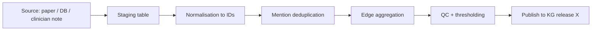

# Knowledge-graph construction

> *Schema design, distant supervision, harmonisation, and the things that decide whether a biomedical KG is a research asset or a liability.*

A KG is easy to *start* and hard to *keep good*. This chapter is about what separates research-grade KGs from the rest.

## Schema design

The biggest decision happens before any data is ingested.

### Reuse ontologies

Reuse existing biomedical ontologies for node and edge types. Re-inventing them produces graphs that don't federate with anything else.

| Domain | Reuse from |
| --- | --- |
| Diseases | **Mondo** (preferred), DO, OMIM, Orphanet. |
| Genes | **HGNC** + **NCBI Gene**. |
| Proteins | **UniProt**. |
| Drugs | **DrugBank** + **ChEMBL** + **RxNorm**. |
| Pathways | **Reactome** + **WikiPathways**. |
| Cellular components / functions | **Gene Ontology**. |
| Cell types | **Cell Ontology**. |
| Brain anatomy | **UBERON** + **Allen Brain Atlas** (mouse) + ontologies layered on top. |
| Imaging features | Project-specific; reference **NIDM** where possible. |
| Phenotypes | **HPO** for human; **MP** for mouse. |
| Cross-vocabulary glue | **UMLS** (where licensed). |

### Mint URIs you control

Even when you reuse ontologies, you own *instance* URIs (a specific experiment, a specific paper-extracted edge). Mint them in a versioned, opaque, dereferenceable scheme:

```
https://kg.yourorg.org/edge/2026/06/sha256-…
```

Avoid embedding meaning in URIs that could change.

### Provenance on every edge

Every edge has:

- `source_paper` or `source_db_release`.
- `extractor` (model name + version) — only if extracted.
- `assertion` (positive / negated / speculated).
- `confidence`.
- `created_at` and `effective_from / effective_to`.

This is the single most important schema decision. Without it the graph is unusable for science.

## Ingestion architecture



Staging tables (not the KG itself) hold raw extractions. The KG receives only edges that passed QC. The KG is treated as an *output* of the pipeline, not the working area.

### Staging schema

A practical Postgres / DuckDB schema:

```sql
CREATE TABLE staged_edges (
    id               UUID PRIMARY KEY,
    source_id        TEXT NOT NULL,          -- e.g. PMID or db_release
    head_mention     TEXT NOT NULL,
    head_norm_id     TEXT NOT NULL,
    head_norm_conf   REAL NOT NULL,
    tail_mention     TEXT NOT NULL,
    tail_norm_id     TEXT NOT NULL,
    tail_norm_conf   REAL NOT NULL,
    relation         TEXT NOT NULL,
    assertion        TEXT NOT NULL,
    extractor        TEXT NOT NULL,
    extractor_ver    TEXT NOT NULL,
    confidence       REAL NOT NULL,
    snippet          TEXT,
    ingested_at      TIMESTAMP NOT NULL
);
```

Edges are aggregated from `staged_edges` into the KG, not inserted one at a time. This is the medallion pattern from data engineering (see [NeuroStack DWI case study](https://phindagijimana.github.io/neuro_stack/data-engineering/dwi-case-study/)) applied to text.

## Normalisation in practice

### Lexical baseline

```python
def normalize_disease(mention: str, kb: DiseaseKB):
    cand = kb.exact(mention) or kb.synonym(mention)
    if cand:
        return cand, 1.0
    return None, 0.0
```

Handles maybe 50% of mentions.

### Embedding-based linker

For the rest, embed the mention and the candidate concepts (with definitions and synonyms); cosine-rank; return the top-1.

```python
def normalize_disease_embed(mention, kb, model):
    m_emb = model.encode(mention)
    scores = m_emb @ kb.concept_embeddings.T
    idx    = scores.argmax()
    return kb.concepts[idx], float(scores[idx])
```

Production: combine both — exact / synonym match first, embedding fallback.

### Multi-source consistency

For each mention, you may run multiple linkers (lexical, embedding, LLM-with-grounding). Track them all and use agreement as a confidence signal.

## Distant supervision in practice

For relation extraction at scale, you bootstrap labels from a known KB:

```python
def distant_label(text, head, tail, relation_kb):
    if relation_kb.has(head, tail, "INHIBITS"):
        return "INHIBITS"
    return None
```

Then train a relation classifier on the resulting (noisy) labels. Apply at scale to the literature. Filter low-confidence extractions; iterate.

This is how Hetionet, ROBOKOP, and similar biomedical KGs were built, with curation layered on top.

## Edge aggregation

A single mention is a weak signal. Multiple mentions, across many papers, agreeing, is a strong signal. Aggregation turns mention-level evidence into edge-level confidence.

A common scheme:

$$
\text{score}(A \xrightarrow{r} B) = 1 - \prod_{i} (1 - c_i \cdot \mathbb{1}[\text{assertion}_i = \text{POSITIVE}])
$$

(Independent-noise OR.) Negated and speculated mentions don't contribute, but they're logged so a downstream consumer can see the disagreement.

Calibrate the score on a held-out gold standard; report calibrated confidence, not raw aggregation.

## Harmonisation across sources

When DrugBank says A inhibits B and PubMed extraction says A activates B, *both* go into the graph — with different sources. The KG does not silently pick a winner.

Schemes for the consumer-facing view:

- **Source priority** — curated DBs > textbook references > extraction.
- **Disagreement flag** — surface conflicts to the consumer; let them decide.
- **Time-weighted** — recent papers override older claims (with care; sometimes the old paper was right).

The consumer-facing view is *built from* the underlying graph; never delete edges, only filter them.

## Versioning

A KG without releases is a moving target.

- Tag releases (`KG-2026-06-16`).
- Pin pipelines to releases.
- Diff releases (added edges, removed edges, changed confidences).
- Publish the diff so downstream models know what changed.

This is the literature-side analogue of pinning a software dependency.

## Tooling

| Tool | Role |
| --- | --- |
| **BioCypher** | Python framework for reproducible biomedical KGs; bridges ontologies and graph databases. |
| **PyOBO** | Loading and harmonising OBO ontologies in Python. |
| **PyKEEN** | KG embedding (TransE, ComplEx, RotatE, RGCN) for link prediction. |
| **Neo4j / Memgraph** | Property graph stores. |
| **Blazegraph / GraphDB** | RDF stores. |
| **Hetionet, ROBOKOP, IndraDB** | Reference biomedical KGs to learn from or compose with. |
| **Robot, OBO toolkit** | Ontology engineering. |
| **dbt + DuckDB / Postgres** | Staging-layer ETL. |
| **Airflow / Prefect / Dagster** | Orchestration. |

## Quality processes

Without a quality process, the KG decays:

- **Sampled audit.** Every release, draw $n$ random edges; experts grade them; track precision over time.
- **Coverage audit.** Compare against curated databases; flag missing edges.
- **Drift audit.** Recompute extraction on a held-out corpus; detect performance regressions in extractor models.
- **Retraction tracking.** Cross-reference PubMed retractions; demote or remove edges sourced only from retracted papers.

Cochrane, NIH, and others publish guidance on biomedical evidence quality; KG processes should reference and conform.

## Honest warnings

- **Most KGs are precision-poor at the edge level.** Calibrate confidence; never present raw aggregations as truths.
- **Ontology updates are routine.** Mondo, MeSH, etc. change every release; your KG must re-map IDs.
- **Licensing matters.** UMLS, SNOMED CT, some commercial databases — read the licenses before redistribution.
- **PII risk.** If you ingest clinical notes, the KG can leak patient identifiers via aggregation. Apply standards (HIPAA Safe Harbor, GDPR-grade pseudonymisation) before ingestion.
- **Consumer assumes truth.** Downstream users assume the KG is curated. Document its provenance prominently or it will be misused.

## References

- Lobentanzer S, et al. Democratizing knowledge representation with BioCypher. *Nat Biotechnol.* 2023.
- Himmelstein DS, et al. Systematic integration of biomedical knowledge prioritizes drugs for repurposing. *eLife.* 2017.
- Bizon C, et al. ROBOKOP KG and KG-Hub: integrated biomedical knowledge graphs. *Bioinformatics.* 2019.
- Ali M, et al. PyKEEN 1.0: a Python library for training and evaluating knowledge graph embeddings. *JMLR.* 2021.

## Where to next

- [Relation extraction](relation-extraction.md) — the upstream NLP.
- [Hypothesis generation](../intermediate/hypothesis-generation.md) — the consumer.
- [Engineer: orchestration](../engineer/orchestration.md) — running this pipeline reliably.
