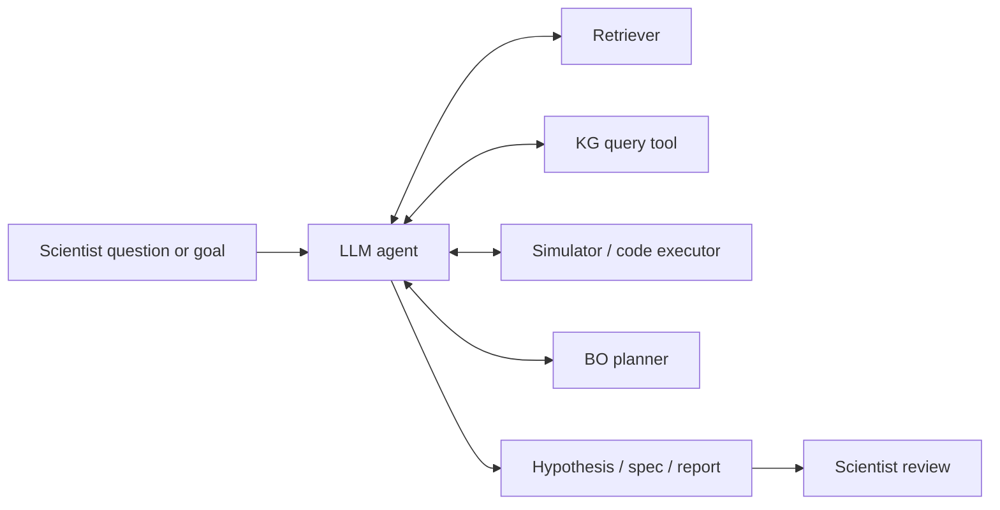

# LLM scientific reasoning

> *Language models as planners, reviewers, and reasoners — with retrieval, tools, and grounding.*

Large language models have become unavoidable in scientific workflows. The technically honest framing: an LLM is a *fluent prior* over scientific text, useful when grounded in retrieval and tools, dangerous when used as an oracle. This chapter is about getting the grounding right.

## What LLMs are actually good at, in science

- **Summarising long technical text.** Producing a faithful, citation-anchored précis of a 40-page paper.
- **Reformatting structured-but-messy data.** Pulling an outcomes table from a Methods section.
- **Reasoning step-by-step over a fixed corpus.** Chain-of-thought over retrieved passages.
- **Translating between formalisms.** Natural language ↔ formal experiment spec.
- **Brainstorming candidates.** Ranked lists of next experiments with rationales.

What they are not good at:

- Citing real, correct sources without retrieval — they confabulate.
- Producing numerical estimates calibrated to evidence.
- Knowing what they do not know.
- Following instructions across long chains without verification.

## Architectures and choices

| Decision | Today's defaults |
| --- | --- |
| Closed vs. open weights | Frontier (Claude, GPT, Gemini) for the hardest reasoning; open (Llama, Qwen, Mistral) for cost-sensitive scale. |
| Domain specialisation | Pre-trained-on-PubMed (PubMedBERT, BioMistral, BioGPT) competitive but trailing frontier general models on reasoning. |
| Tool use | Required for any production system that touches data. |
| Retrieval | Required for any factual task. |
| Memory | Needed for multi-session agents; lightweight implementations OK. |

For a research lab, the practical configuration is: a strong general LLM as the reasoner, a smaller domain model for embeddings, a retrieval store of papers and database extracts, and tools for KG queries, statistics, and code execution.

## The agent shape



The LLM's role is *orchestration*: it decides which tool to call, in what order, and how to integrate results. Each tool is verifiable; the LLM's narrative is auditable against tool outputs.

## Prompting patterns for science

### Decomposition

Long scientific questions go badly when sent as a single prompt. Decompose:

```
1. Re-state the question precisely.
2. List the sub-questions whose answers would settle it.
3. For each, pick a tool (retrieval / KG / simulator) and gather evidence.
4. Synthesise.
5. List unresolved uncertainties.
```

Have the model produce all five sections, even if rough.

### Citation discipline

A useful pattern: *every numerical claim must carry a bracket-citation tied to a retrieved passage*. The post-processor verifies that the bracket-cited passages exist and contain the claim. Citations the verifier rejects are stripped or rewritten.

### Self-criticism / debate

Two LLM passes: one to propose, one to critique. The critique pass is given the same retrieval results and explicitly asked to find errors. Reduces overconfidence in the first pass.

### Constrained outputs

Always prefer structured output (JSON Schema, regex grammars) over free text for any output that downstream code will parse. Modern decoding libraries make this cheap.

## Retrieval-augmented reasoning

The LLM cannot generate facts beyond its training data. Retrieval gives it current evidence.

The pipeline:

```
question → embed → search vector index → top-K passages →
    rerank → format as context → LLM with strict citation prompt → answer
```

Choice points:

- **Chunk size.** Per-paragraph chunks reduce hallucination, but lose context. ~512 tokens is the standard compromise.
- **Embedder.** SPECTER (papers), BioMedBERT (biomedical), or a frontier text-embedding API.
- **Reranker.** A cross-encoder (e.g., MiniLM rerankers) over the top-K candidates. Usually worth the extra latency.
- **Query expansion.** Generate paraphrases of the question and merge their retrievals. Helps especially for narrow biomedical terminology.

See [retrieval-augmented generation](rag-systems.md) for the full architecture.

## Acting on the world

Scientific agents need to *do*, not just say:

- Submit an experiment to the planner.
- Query the KG.
- Run a statistical test on extracted data.
- Schedule a wet-lab follow-up.

Tool interfaces should be:

- **Typed.** Argument schemas.
- **Idempotent where possible.** A retried tool call shouldn't run the experiment twice.
- **Logged.** Every call, with arguments, response, and timing.

The LLM is the planner; the *tools* are what the lab actually feels.

## Grounding in domain knowledge

The "grounding spine" for an autonomous-lab LLM agent:

| Layer | Source |
| --- | --- |
| Vocabulary | UMLS, MeSH, Gene Ontology. |
| Curated facts | DrugBank, Reactome, ClinicalTrials.gov, KEGG. |
| Recent literature | PubMed, PMC, preprint servers. |
| Internal data | Lab's prior experiments + provenance. |
| Live state | Current planner belief, current robot status, current calibration. |

An ungrounded LLM agent is a chatbot. A grounded one is a research assistant.

## Evaluation

| Metric | What it measures |
| --- | --- |
| **Citation accuracy** | Fraction of bracket-cited claims that are supported by the cited passage. |
| **Retrieval recall@K** | Fraction of relevant passages in the top K. |
| **Tool-use correctness** | Fraction of tool calls with correct arguments. |
| **Hypothesis quality (expert)** | Domain expert grading on Likert scales. |
| **End-to-end task success** | For agent settings — did the goal happen? |

Public benchmarks worth knowing:

- **BioASQ** — biomedical QA.
- **PubMedQA** — yes/no/maybe over abstracts.
- **MedQA / MedMCQA** — clinical knowledge.
- **SciFact / SciBench / GAIA** — scientific reasoning with retrieval and tools.
- **LAB-Bench, ScienceAgentBench** — emerging agent benchmarks.

## Honest warnings

- **Hallucination is the dominant failure.** No prompt eliminates it; only retrieval + verification suppress it.
- **Determinism is hard.** Temperature, sampling, model updates all break repeatability. Pin model versions; record seeds; cache.
- **Long agents drift.** Across many tool calls, errors compound. Bound the trace; require checkpoints.
- **Cost can explode.** A single bad agent loop can burn dollars in API calls. Budget caps and circuit-breakers are required.
- **Model updates change behaviour silently.** Vendor model upgrades have produced regressions. Version your prompts *and* your model.

See [engineer: observability](../engineer/observability.md) for the runtime patterns.

## References

- Yao S, et al. ReAct: synergizing reasoning and acting in language models. *ICLR.* 2023.
- Schick T, et al. Toolformer: language models can teach themselves to use tools. *NeurIPS.* 2023.
- Luo R, et al. BioGPT: generative pre-trained transformer for biomedical text generation and mining. *Brief Bioinform.* 2022.
- Wang X, et al. SciBench: evaluating college-level scientific problem-solving abilities of large language models. *arXiv:2307.10635.* 2023.
- Chen Z, et al. ScienceAgentBench: toward rigorous assessment of language agents for data-driven scientific discovery. *arXiv:2410.05080.* 2024.

## Where to next

- [Retrieval-augmented generation](rag-systems.md) — the grounding architecture in detail.
- [Hypothesis generation](../intermediate/hypothesis-generation.md) — the consumer-facing layer.
- [Engineer: safety & governance](../engineer/safety-governance.md) — keeping LLM-driven agents inside the rails.
