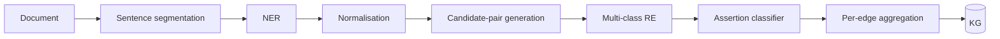

# Relation extraction

> *Sentence- and document-level architectures for pulling biomedical relations from free text.*

NER finds entities. Relation extraction (RE) decides whether two entities in a span of text are related, and how. RE is the bottleneck for the quality of every knowledge graph and every literature-driven hypothesis system downstream.

## Problem framings

| Framing | Input | Output | Use when |
| --- | --- | --- | --- |
| **Binary RE** | A sentence with two marked entities. | Yes/no for a fixed relation. | Pipeline of one-vs-rest classifiers. |
| **Multi-class RE** | A sentence with two marked entities. | One of $K$ relations (or "no relation"). | Standard biomedical RE benchmarks. |
| **Joint NER + RE** | A sentence. | Set of entity spans + relation tuples. | When entity boundaries are ambiguous. |
| **Document-level RE** | A whole document with all entities marked. | Relations across sentences. | Real papers — most relations span sentences. |
| **N-ary / event** | A sentence or document, with marked entities. | Event with several typed roles. | Pathway extraction, complex assertions. |

Production systems typically use multi-class RE at sentence level for the bulk and document-level RE for harder relations.

## Architectures

### Pre-transformer baselines

- **Kernel methods** (subsequence / tree / graph kernels) — slow but interpretable.
- **CNN with position embeddings** — sentence-level, fast, surprisingly competitive on small data.
- **PCNN with attention** — for distant supervision noise.

Still useful as guard-rails and for explanations.

### BERT-family

The 2018+ default: feed `[CLS] sentence [SEP]` with the two entities marked (special tokens or marker tokens), pool, classify.

```
Phenytoin <e1>is associated with</e1> hippocampal sclerosis ...
[CLS] [E1] Phenytoin [/E1] is associated with [E2] hippocampal sclerosis [/E2] ... [SEP]
→ pooled [CLS] embedding → linear → softmax over relation labels
```

Variants:

- **R-BERT** — concatenate the [CLS] embedding with the per-entity embeddings.
- **SpanBERT / Span-aware models** — explicitly represent entity spans.
- **PURE** — strong joint entity + relation pipeline; separate encoders, simple decoding.

Domain pre-training (PubMedBERT, BioBERT, SciBERT) typically gains 2–5 F1 over generic BERT on biomedical benchmarks.

### Document-level RE

Relations span sentences. Standard architectures:

- **Long-context transformers** (Longformer, BigBird, LongT5) — encode the full document.
- **Graph-based decoders** — build a heterogeneous graph over entities, sentences, mentions; run a GNN; predict edges.
- **ATLOP** — adaptive thresholding + localised context pooling; strong on DocRED.
- **BioGRER, EIDER, KD-DocRE** — biomedical-tailored document-level architectures.

The DocRED benchmark drove much of this; biomedical document RE benchmarks like CDR (chemical-disease relations) sit alongside it.

### Generative RE

LLMs as RE models: prompt with the sentence and ask for structured output (JSON of relations). Increasingly competitive on rare relation types where labelled data is scarce; expensive at scale; verifiable only with downstream checks.

A robust pattern:

```
You will see a sentence with marked entities <e1>...</e1> and <e2>...</e2>.
Output exactly one JSON object with fields:
  relation: one of [INHIBITS, ACTIVATES, ASSOCIATED_WITH, TREATS, NO_RELATION]
  assertion: one of [POSITIVE, NEGATED, SPECULATED]
  confidence: a number in [0, 1]
```

Use grammar-constrained decoding so the output is parseable. Verify the relation against a guard-rail dictionary (e.g., HOMER, SemRep) before accepting.

## Distant supervision

For rare or expensive relations, labels are scarce. Distant supervision generates labels automatically by aligning text to a knowledge base: if KB says A inhibits B and a sentence mentions both A and B, label that sentence as `INHIBITS`. Noisy but plentiful.

Mitigations:

- **Multi-instance learning** — choose the highest-confidence mention per pair.
- **Attention over mentions** — learn to weight mentions.
- **Iterative refinement** — re-train on the model's high-confidence predictions; reduce noise over rounds.

Distant supervision is how most biomedical RE models are bootstrapped.

## Negation, hedging, and assertion

A relation extracted without negation handling is misinformation. Production RE systems output an *assertion* alongside the relation: `POSITIVE`, `NEGATED`, `SPECULATED`, `CONDITIONAL`.

Approaches:

- **Rule-based** (NegEx, ConText). Still surprisingly competitive.
- **Joint assertion classifier** (BERT head trained on assertion-annotated corpora).
- **Generative output with assertion field**, as in the LLM example above.

Without an assertion, your KG will claim "Drug A inhibits Protein B" when the paper actually says "Drug A does not inhibit Protein B".

## Evaluation

Common benchmarks:

| Benchmark | Domain | Task |
| --- | --- | --- |
| **BC5CDR** | Chemicals, diseases | Sentence-level chemical-induces-disease relation. |
| **GAD** | Genes, diseases | Gene–disease association. |
| **ChemProt / DrugProt** | Drugs, proteins | Chemical–protein relations. |
| **BioRED** | Multi-entity | Multiple relation types. |
| **CDR (BioCreative V)** | Chemical, disease | Document-level. |
| **DDI** | Drug pairs | Drug–drug interaction. |
| **PGR** | Phenotypes, genes | Phenotype–gene relations. |

Metrics: micro-F1 over relations (standard); macro-F1 (better when relation distribution is skewed); document-level F1 with strict matching for DocRE.

Beware: state-of-the-art on BC5CDR (~0.65–0.72 F1) is a long way from "trust without verification". A KG built from these signals needs aggregation across many mentions before treating a fact as solid.

## Aggregation across mentions

A single sentence is weak evidence. Many sentences across many papers, agreeing, are strong evidence. KGs encode this:

- **Edge weight** = some aggregation of per-mention confidence (sum, log-sum, sigmoid of count).
- **Edge metadata** = list of supporting PMIDs and snippets.
- **Confidence calibration** — a curve mapping aggregate score to probability-of-truth, fit on a gold-standard subset.

Without aggregation, your KG over-weights any one paper; with aggregation, you can drop noisy edges below a calibrated threshold.

## Failure cases worth knowing

- **Coreference.** "It inhibits the kinase" — what is "it"? Without coreference resolution, you mis-identify the agent.
- **Long subject-object distance.** A drug at the start of a sentence, a protein at the end, with several intermediate clauses. Sentence-level models miss the relation.
- **Negation under speculation.** "It is unlikely that A inhibits B" — both speculation and negation. Many classifiers miss one of the two.
- **Causal hedge.** "A was associated with B" vs. "A caused B". The literature is mostly the former; your downstream code may need the distinction.
- **Domain shift.** A model trained on cancer biomedical literature underperforms on epilepsy / neurology literature.

## Production deployment

A practical pipeline for production RE:



Every box has a versioned model and a tracked benchmark score. Drift detection compares scores on a held-out evaluation set monthly. See [engineer: reproducibility](../engineer/reproducibility.md) for the audit shape.

## References

- Gu Y, et al. Domain-specific language model pretraining for biomedical natural language processing. *ACM Trans. Comput. Healthc.* 2022.
- Zhong Z, Chen D. A frustratingly easy approach for entity and relation extraction. *NAACL.* 2021.
- Zhou W, et al. Document-level relation extraction with adaptive thresholding and localized context pooling. *AAAI.* 2021.
- Li J, et al. BioCreative V CDR task corpus: a resource for chemical disease relation extraction. *Database.* 2016.
- Luo L, et al. BioRED: a rich biomedical relation extraction dataset. *Brief Bioinform.* 2022.

## Where to next

- [KG construction](kg-construction.md) — what RE feeds.
- [LLM scientific reasoning](llm-scientific-reasoning.md) — using LLMs above RE.
- [Engineer: observability](../engineer/observability.md) — drift detection in production.
